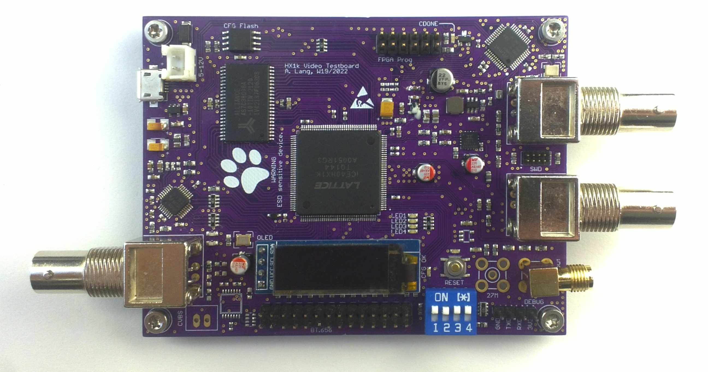

# HX1k-SDI
An SDI encoder/serializer on Lattice iCE40 FPGAs

The iCE40 series of FPGAs is low cost and is supported by an opensource toolchain (though not currently used for this project)
The devices are low density and low speed and lack advanced features like SerDes or true LVDS-IO, though.

## Abstract
This project implements an SD-SDI serializer (aka transmitter) completely in fabric, requiring nothing but an unused PLL
that is used to generate a 135MHz from an externally supplied 27MHz sample clock (27MWords/s with CbYCrY 4:2:2 encoding, 
13.5MHz pixel clock).
Most of the logic operates at 27MHz with just the final multiplexer and a DDR-out buffer running at the full 135MHz.

## Scope
This project contains a complete eval board for SDI video generation on
iCE40-HX FPGAs. UP-series might work, too, but it's unclear if the IOB and Fabric are fast enaugh
(might test it on iCEBreaker at some point in time).

## Contents
This project consists of the following subfolders:
 * fpga: the FPGA design (VHDL, iCECube2 project)
 * hardware: The board design (eagle 6), schematic diagrams as PDF
 * firmware: Firmware for the ATSAMD21 MCU that is on the board as well
 * release: synthesized FPGA config, firmware image, gerbers etc

